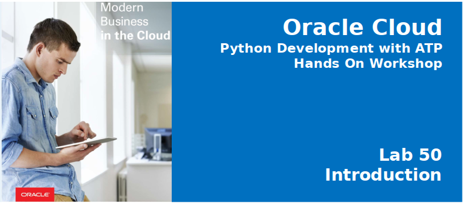
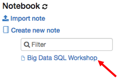
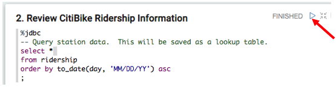

# Lab 100: Review Ridership (Database and Object Store)
  

## Introduction

In Lab 100, you will review CitiBike ridership trends over a several month time period using a Zeppelin note.  This ridership information is available in Oracle Database 18c.  You will then augment ridership information with weather data sourced from Oracle Object Store - allowing you to see how weather potentially impacts usage.  This weather data is not loaded into Oracle Database; rather, Big Data SQL will allow dynamic access to this new object store source thru Oracle SQL.   

## Lab 100 Objectives

- Use Zeppelin to report on data captured in Oracle Database 18c
- Learn how to seamlessly access data in Oracle Object Store from Oracle Database using Big Data SQL-enabled external tables.

## Steps

### **STEP 1:** Log into Zeppelin and open Big Data SQL Workshop note

From your browser, log into Zeppelin using the following URL:
  [http://bigdatalite.localdomain:8090/#/](http://bigdatalite.localdomain:8090/#/)

 * Click the **Login** button on the top right and log in using `oracle / welcome1`.

* Open note **Big Data SQL Workshop**:

    

### **STEP 2:** Review Ridership Information

* Run a query against Oracle Database to see ridership trends.  Click the **Run this Paragraph button** or hit **[shift][enter]**

  
  
  The chart shows the daily trends of bike trips in New York City. We'll now add some more context by adding weather data that's available in Oracle Object Store.

- From any browser go to

  [https://cloud.oracle.com/en_US/sign-in](https://cloud.oracle.com/en_US/sign-in)

\

### **STEP 9:** Download Files Used in this Workshop

**Click to Download**

[lab-resources.zip](https://dgcameron.github.io/python4atp/workshops/python4atp/lab-resources.zip)

**This completes the Lab!**

**You are ready to proceed to [Lab 100](LabGuide100.md)**
