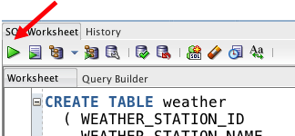

# Lab 100: Review Ridership (Database and Object Store)
  

## Introduction

In Lab 100, you will review CitiBike ridership trends over a several month time period using a Zeppelin note.  This ridership information is available in Oracle Database 18c.  You will then augment ridership information with weather data sourced from Oracle Object Store - allowing you to see how weather potentially impacts usage.  This weather data is not loaded into Oracle Database; rather, Big Data SQL will allow dynamic access to this new object store source thru Oracle SQL.   

## Lab 100 Objectives

- Use Zeppelin to report on data captured in Oracle Database 18c
- Learn how to seamlessly access data in Oracle Object Store from Oracle Database using Big Data SQL-enabled external tables.

## Steps

### **STEP 1:** Log into Zeppelin and open the Big Data SQL Workshop note

* From your browser, log into Zeppelin using the following URL:
  [http://localhost:8090/#/](http://localhost:8090/#/)

* Click the **Login** button on the top right and log in using `oracle / welcome1`.

* Open note **Big Data SQL Workshop**:

    

### **STEP 2:** Review Ridership Information

* Run a query against Oracle Database to see ridership trends.  Click the **Run this Paragraph button** or hit **[shift][enter]**

  
  
  The chart shows the daily trends of bike trips in New York City. We'll now add some more context by adding weather data that's available in Oracle Object Store.


### **STEP 3:** Create `weather` Table in SQL Developer
Weather data is captured in a public bucket in Oracle Object Store.  You can view the contents of the weather here:  [https://swiftobjectstorage.us-phoenix-1.oraclecloud.com/v1/adwc4pm/weather/weather-newark-airport.csv](https://swiftobjectstorage.us-phoenix-1.oraclecloud.com/v1/adwc4pm/weather/weather-newark-airport.html).  Create a Big Data SQL table over this file using the `ORACLE_BIGDATA` driver.
* In the SQL Developer worksheet, scroll to the `CREATE TABLE weather` statement.  A snippet of the statement is listed below.  
    * `ORACLE_BIGDATA` signifies that the data is sourced from the object store.  
    * `com.oracle.bigdata.*` fields define the attributes for the file
    * `LOCATION` identifies the URI for the file(s) in the object store

        ```sql
        CREATE TABLE weather
        ( WEATHER_STATION_ID      VARCHAR2(20),
            WEATHER_STATION_NAME    VARCHAR2(100),
            REPORT_DATE             VARCHAR2(20),
            AVG_WIND                NUMBER,
            PRECIPITATION           NUMBER,
            SNOWFALL                NUMBER,
            SNOW_DEPTH              NUMBER,
            TEMP_AVG                NUMBER,
            TEMP_MAX                NUMBER
            ....
            )
        ORGANIZATION EXTERNAL
        (TYPE ORACLE_BIGDATA
        DEFAULT DIRECTORY DEFAULT_DIR
        ACCESS PARAMETERS
        (
            com.oracle.bigdata.fileformat = textfile 
            com.oracle.bigdata.csv.skip.header=1
            com.oracle.bigdata.csv.rowformat.fields.terminator = '|'
        )
        location ('https://swiftobjectstorage.us-phoenix-1.oraclecloud.com/v1/adwc4pm/weather/*.csv')
        )  
        REJECT LIMIT UNLIMITED;
        ```
* Click the **Run Statement** button or hit **F9** to create the table 
    images/100/run-cmd.png    
    

**This completes the Lab!**

**You are ready to proceed to [Lab 200](LabGuide200.md)**
