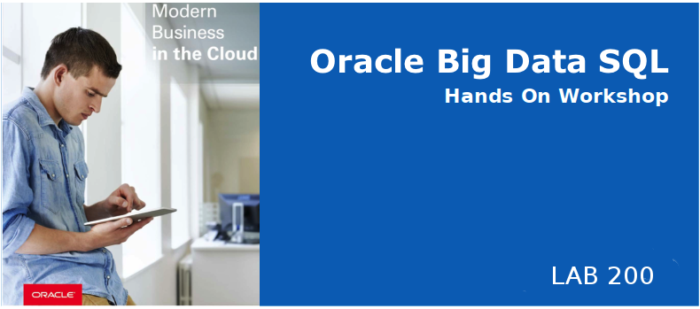
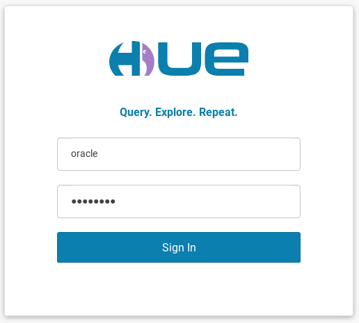
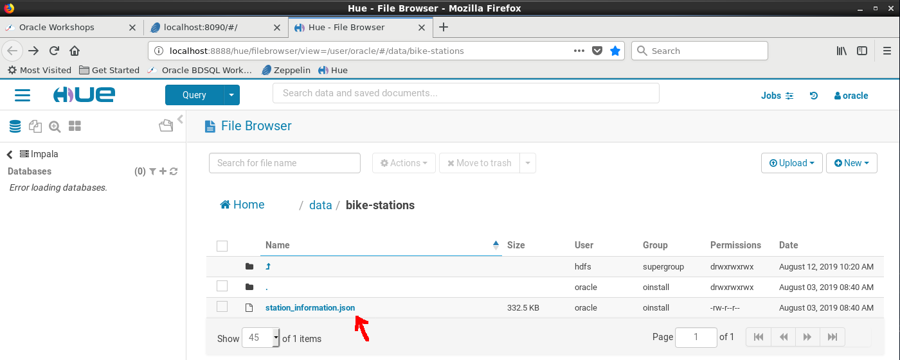
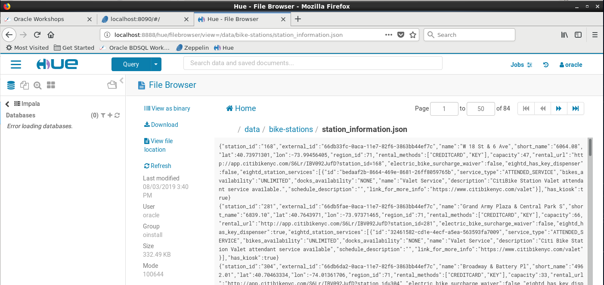
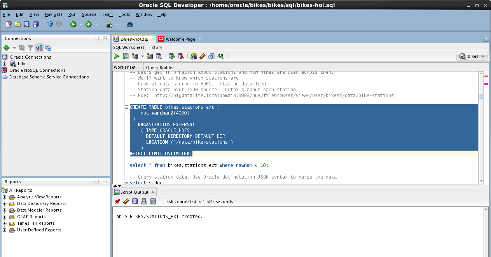
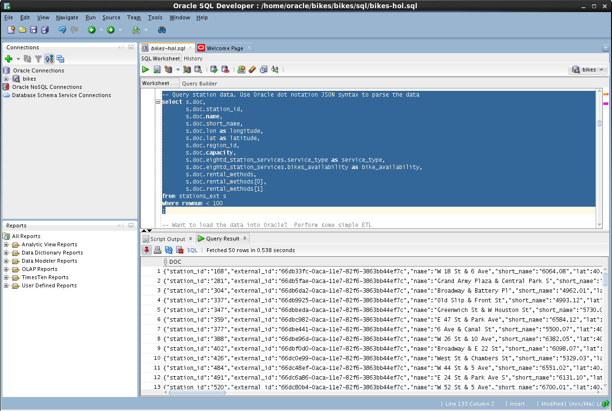
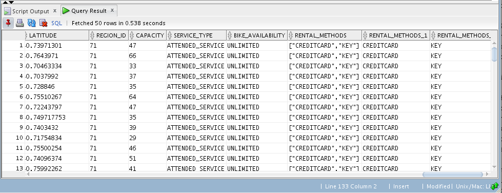
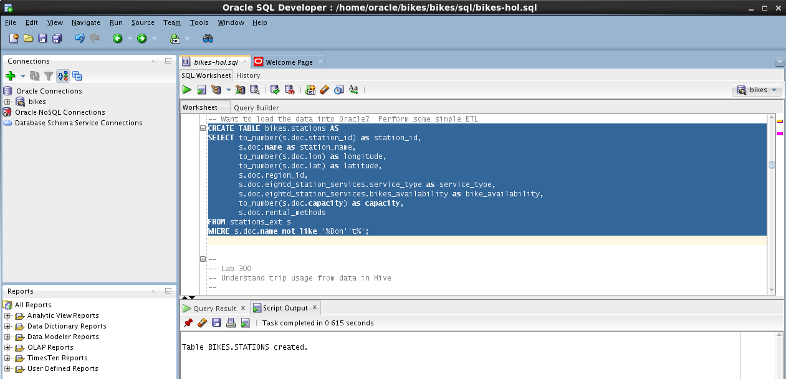

# Lab 200: Gather Station Details

  
  

## Introduction

In Lab 200, you will create an Oracle table that refers to a file stored in hdfs. This file contains station details data in JSON format. You will use Oracle SQL JSON "dot notation" to parse the fields and create a station details table.

## Lab 200 Objectives

- Connect to HUE and review the stations JSON data file stored in the HDFS filesystem
- Create a Big Data SQL external table called `bikes.station_ext` referring to this file
- Perform some simple ETL by creating a table called `bikes.stations` from the `bikes.stations_ext` using Oracle SQL JSON dot notation

## Steps

### **STEP 1:** Check the data files in hdfs

 * From your browser, connect to HUE : http://localhost:8888 and login using `oracle / welcome1`.  You can use the Hue bookmark on the browser toolbar.
 
    
 
* Browse the content of the file `station_information.json`

    

* Notice that the file format is JSON

    

### **STEP 2:** Create an oracle table called `bikes.station_ext`
Make the JSON data available for queries in Oracle Database by creating a Big Data SQL external table
* Run the following statement from SQL Developer 

    Notice the `TYPE ORACLE_HDFS` statement indicating that the file is on the HDFS filesystem, and `LOCATION` indicating the directory where the file resides

    

### **STEP 3:** Show the JSON parsing capabilities of the Oracle Database using the JSON dot notation

* Run the following statement from sql developper

    

    Scroll right on the query result tab and notice how one can access JSON nested fields with the "." notation.  Access to arrays with the "[]" notation

    

### **STEP 4:** Create an Oracle table called `bikes.station` using JSON dot notation 

Perform simple ETL by loading the JSON data into an Oracle table called `bikes.station`.
* Run the following statement from SQL Developer

    

### Summary
You accessed JSON data stored in HDFS using a Big Data SQL external table - leveraging the `ORACLE_HDFS` driver.  This table will be used frequently as a dimension table - so it was loaded into a new table `bikes.stations`.

**This completes the Lab!**

**You are ready to proceed to [Lab 300](LabGuide300.md)**
