# Lab 300: Setup Cloud Environment

  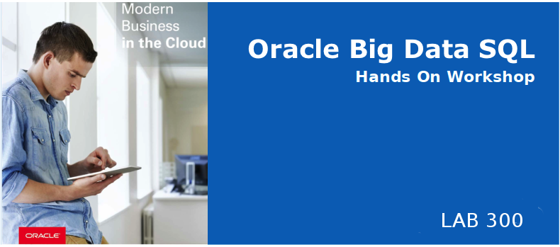

## Introduction

In Lab 300 you will acces all recorded bike trips stored in Hive, create an Oracle table from it and use analytical SQL to understand bike movement and bike problems.

## Lab 300 Objectives

- Connect to HUE and show the `trips` hive table 
- Create an oracle table out of this hive table
- Run analytical sql statements to understand bike movement and problems
- Create a materialized view holding trips problems and see automatic query rewrite happening
## Steps

### **STEP 1:** Connect to HUE and show the trips Hive table

* If not logged on already, connect to HUE : http://localhost:8888 (`oracle`/`welcome1`). 
* Select the hive query engine from the "Query" menu
  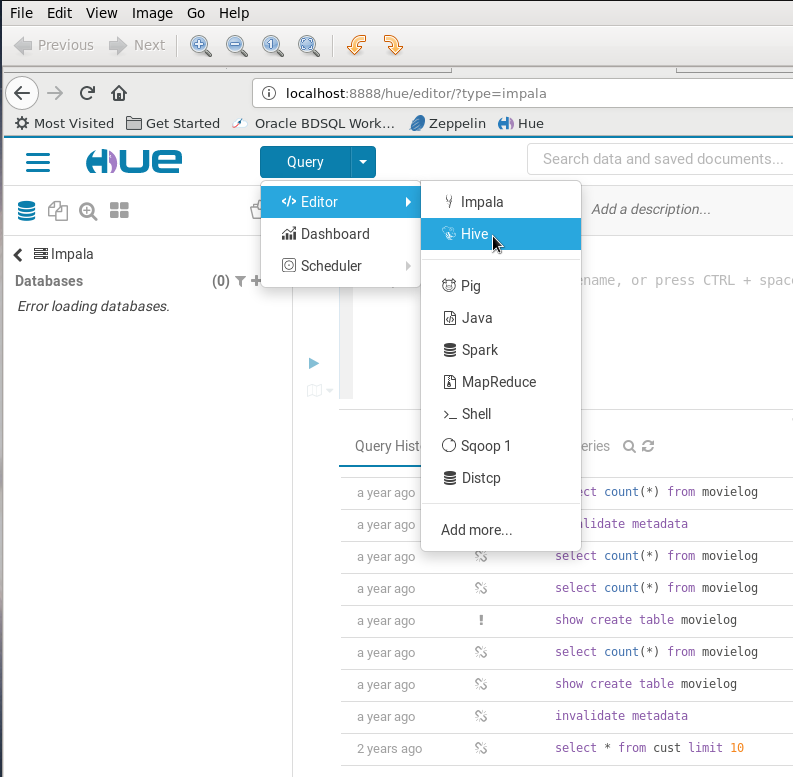
* Select the `bikes` database 
  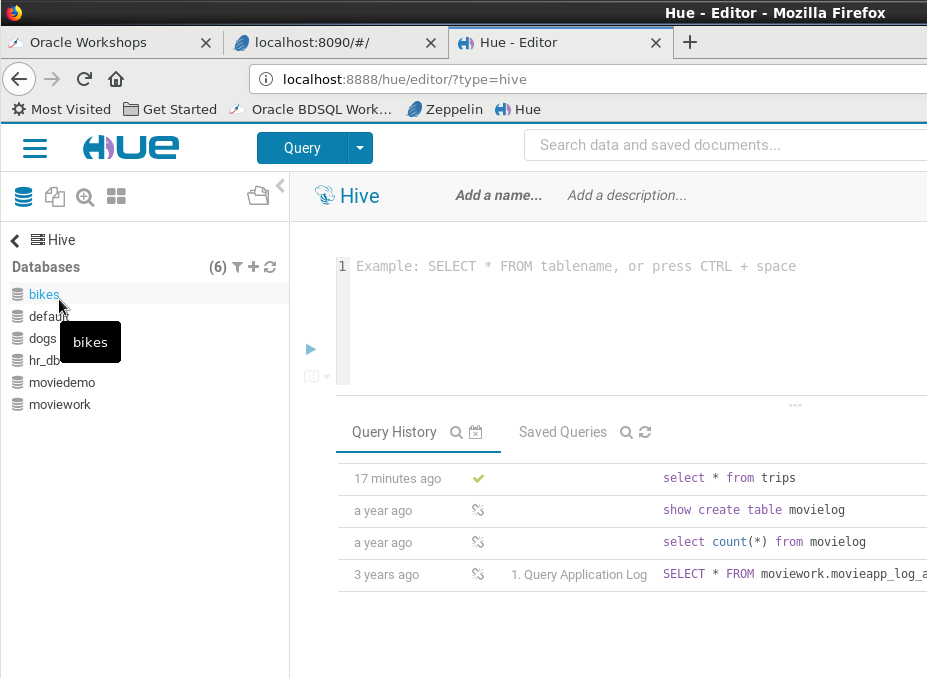
* Show the `trips` table content
  
  Enter `select * from trips` in the query field and hit the execute button like below :
  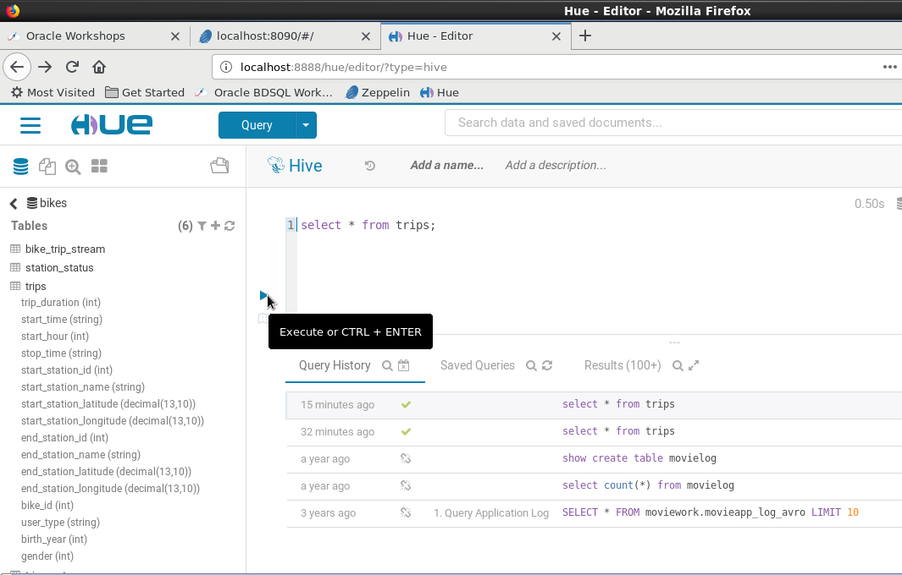
* You will see the datas contained in the hive table
    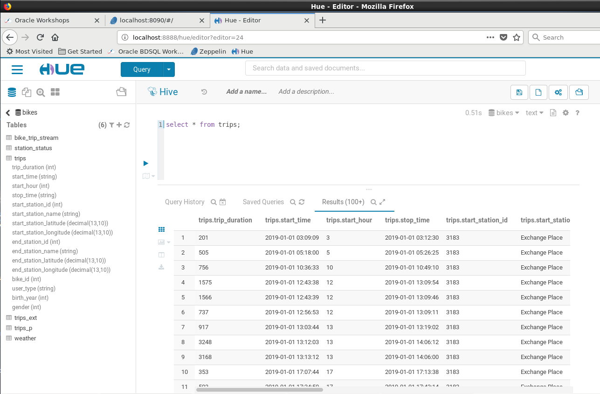

### **STEP 2:** Create an oracle table `trip_exts` 
- Run the following statement from Oracle SQL Developer 

  Notice the `TYPE ORACLE_HIVE` statement indicating that the source is the Hive table defined in the  `com.oracle.bigdata.tablename` parameter. 
    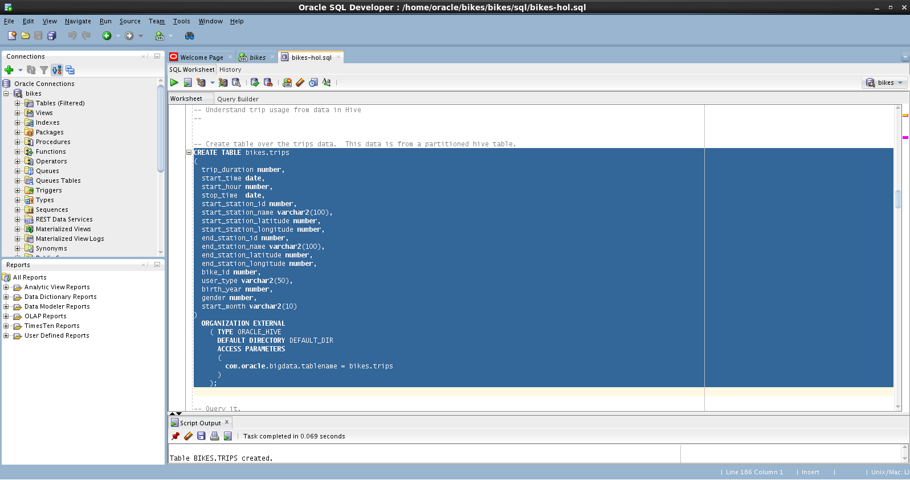

- Check that you can query this new table
    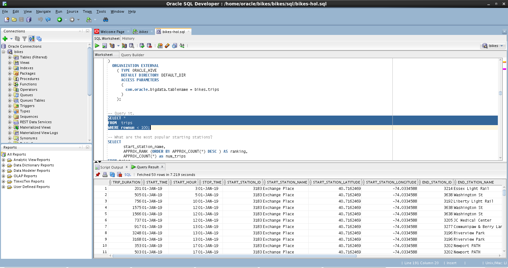

- Show the most popular starting stations for bikes trip
    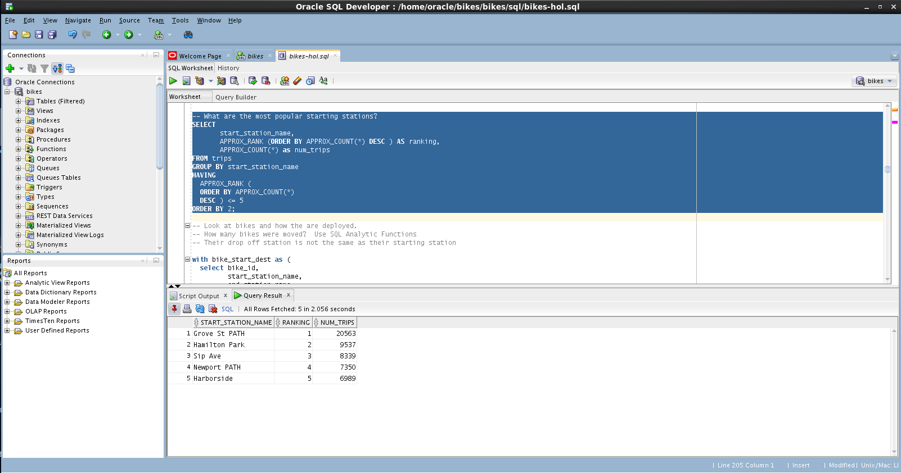

### **STEP 3:** Run analytical sql statments

- Show how many bikes were moved (from one station to another) over the 2019 June month
  Notice the `LAG` function usage that lets you query more than one row in a table at a time without having to join the table to itself.
    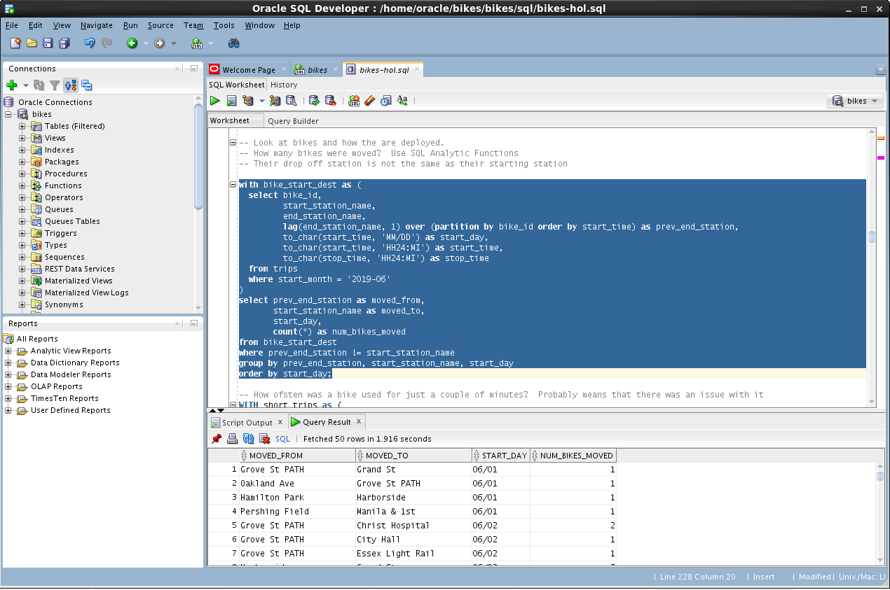

- 
### **STEP 4:** Create a materialized view holding trips problems
 
- Show bikes that were used only for a couple of minutes, which may indicate some issue with this bike
    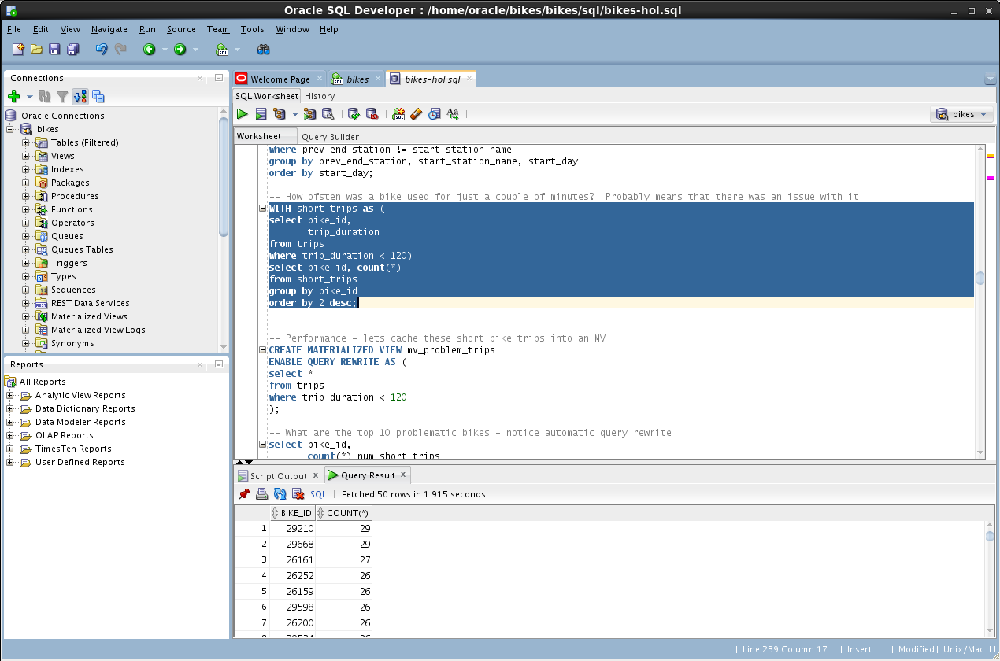

- Create a materialized view for better performance
    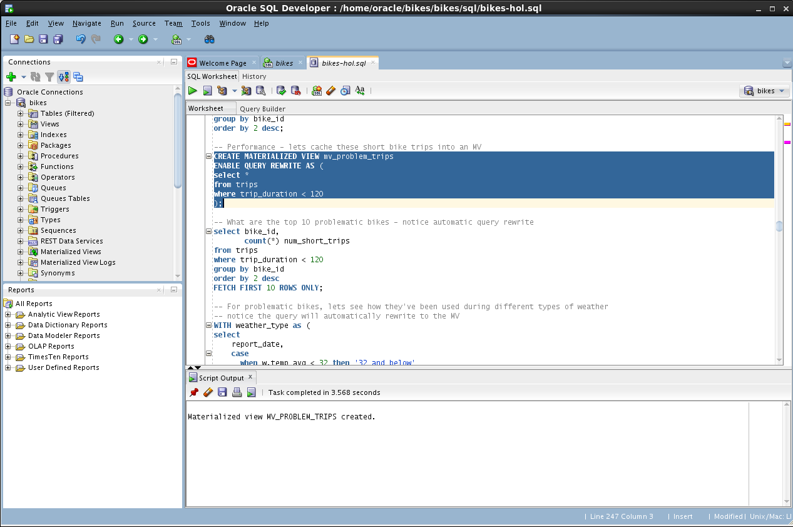

- Check the top 10 most problematic bikes and see automatic query rewrite happening 
    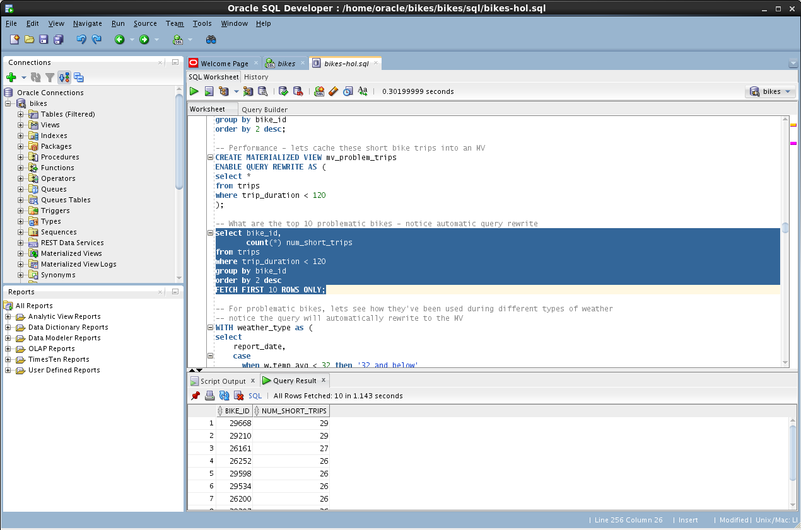

- Show the execution plan from the autotrace by hitting the `F6` button
  
  Notice how the query has been rewritten and is actually using the materialized view `mv_problem_trips` when the query was has a `from trips` statement
    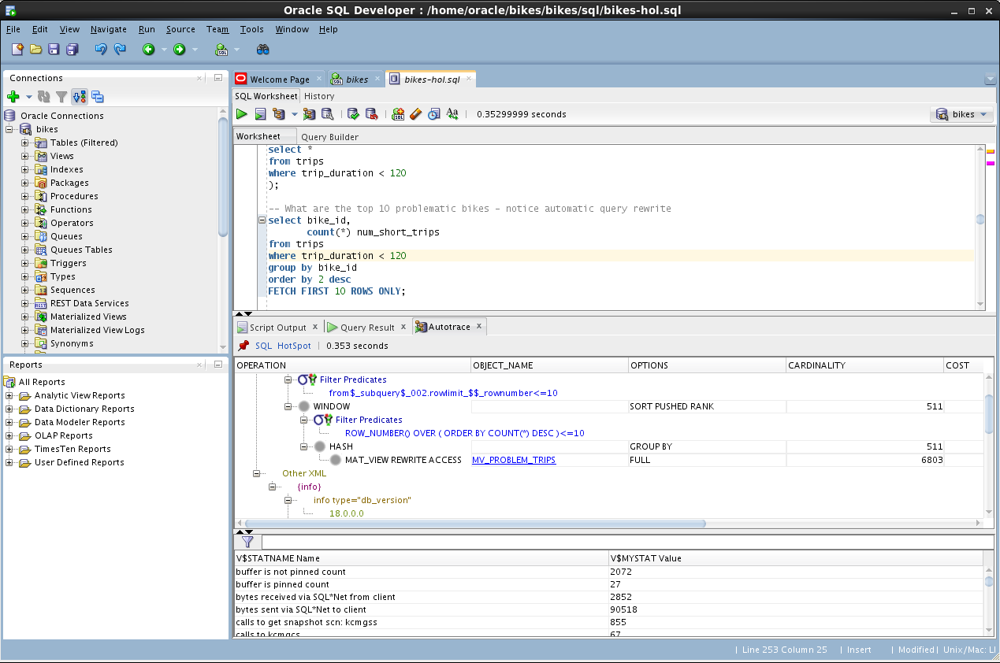

- For problematic bikes, see how they have been used during different types of weather
    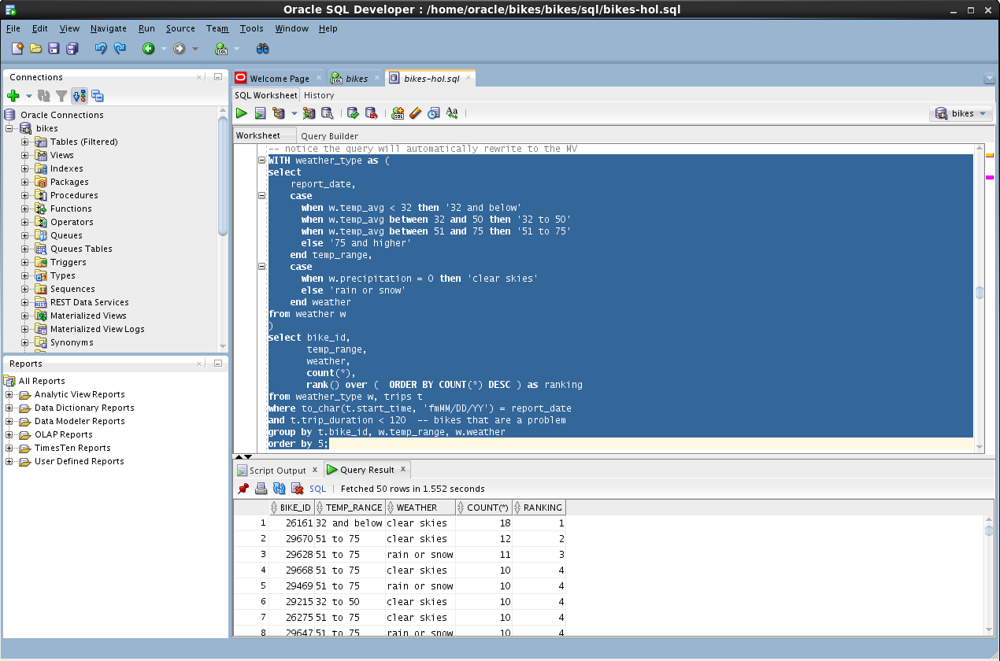

## Summary
You have accessed bike trips data store in Hive leveraging the  `ORACLE_HIVE` driver. You have identified the problematic bikes using analytical sql and stored them into a materialized view.
**This completes the Lab!**

**You are ready to proceed to [Lab 400](LabGuide400.md)**
