# Lab 400: How are bikes deployed right now ?

  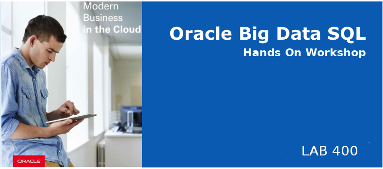

## Introduction

In Lab 400 you will access latest station information, stored in a kafa streams.

## Lab 400 Objectives

- Open zeppelin and start the kafka stream
- Create an Oracle table `station_status` from this kafa stream
- Use the JSON_DATAGUIDE function to parse the JSON format and create a `v_station_status` view
- Query this newly created view to show how many bikes are available per station 
- Display the results in zeppelin

## Steps

### **STEP 1:** Connect to zeppelin 

- Connect to the zeppelin with your web browser : http://localhost:8090.

- Click the `login` button in the upper right side
  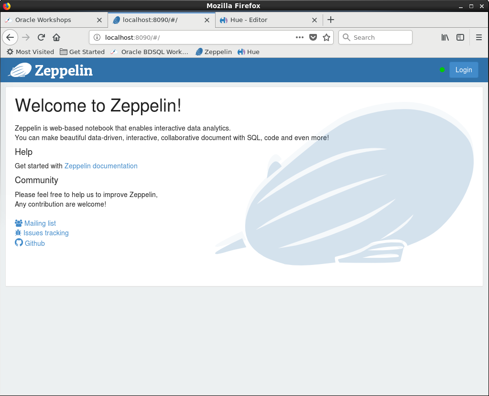

- log in using `oracle` / `welcome1` 
    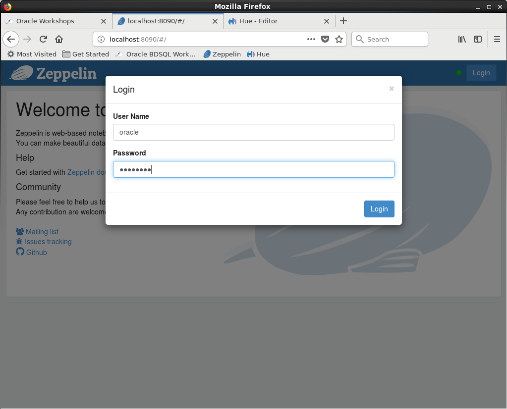

- open the `Big Data SQL Workshop` note by clicking it
    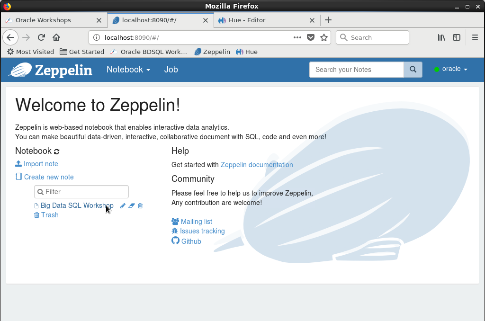

### **STEP 2:** Start the kafka stream
- Go to note #3 and hit the start arrow to start the kafka stream 
    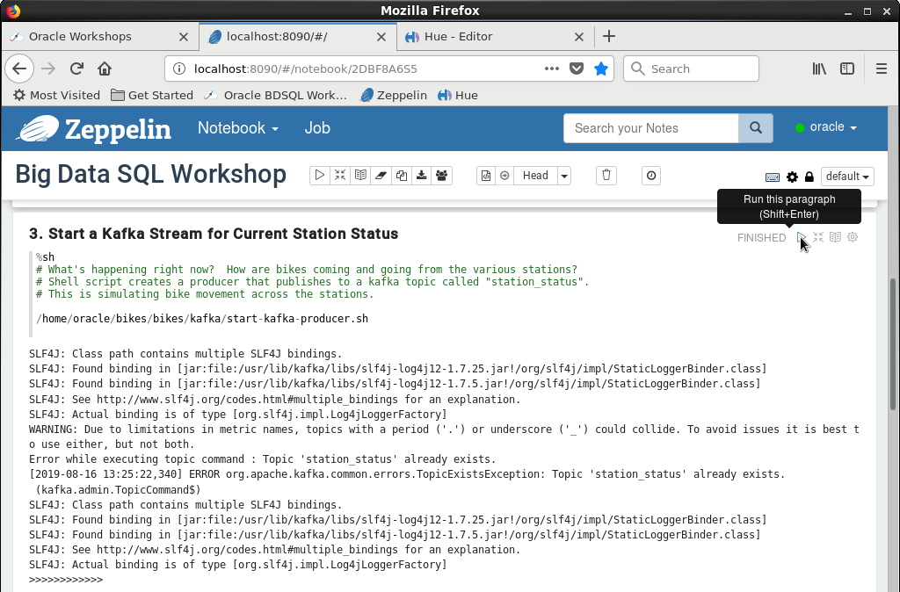
- Go to note #4 and hit the start arrow to start a kafka consumer
    
    This will show that the kafka streams hold JSON data describing stations status
    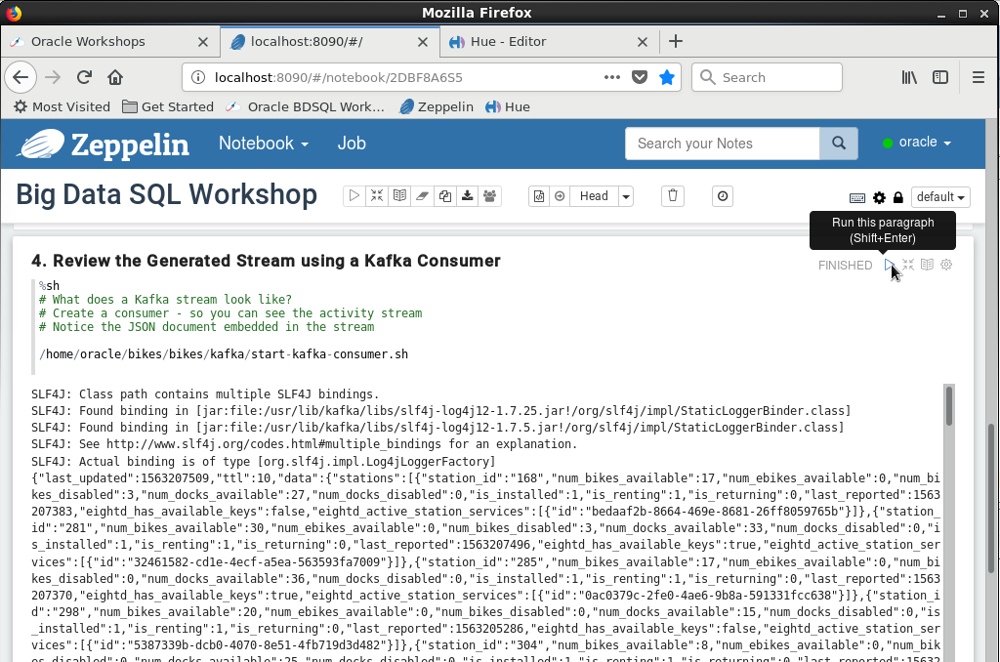

### **STEP 3:** Create a table from the kafka stream
- From SQL developer, run the following statement to create the `station_status` table
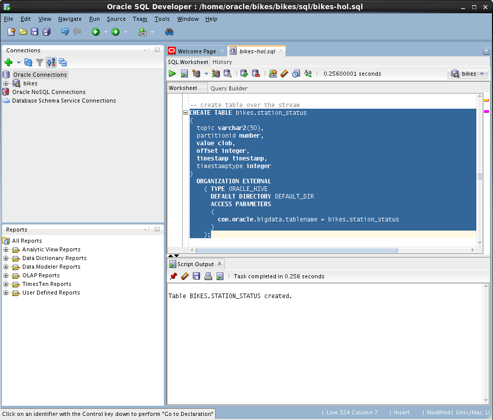

- Query this newly created table
You will see that at this point the data is still in JSON format
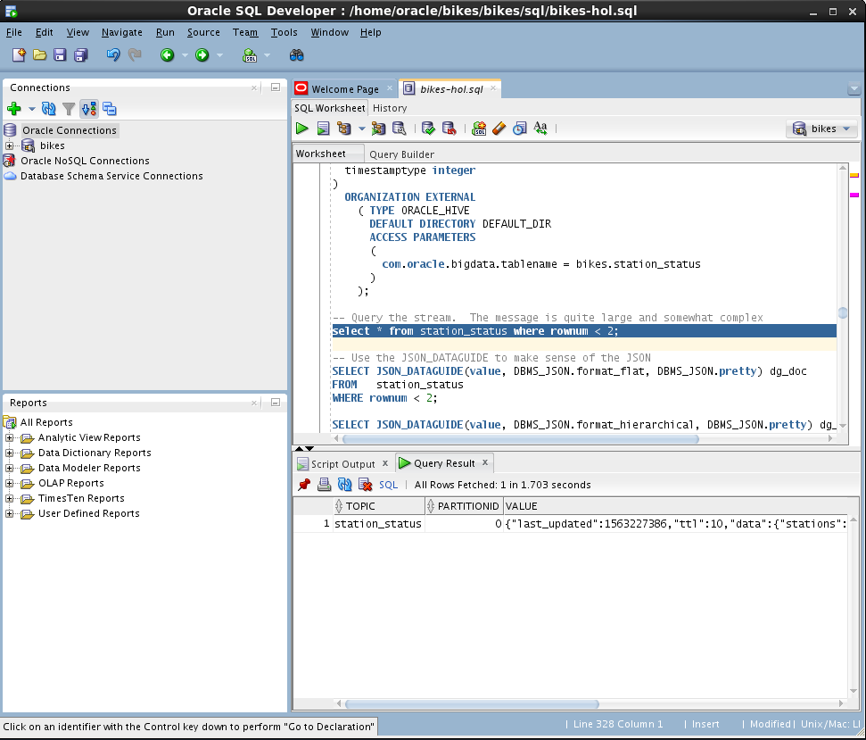

### **STEP 4:** Use JSON_DATAGUIDE function to parse JSON format
- use the JSON_DATAGUIDE function to make sense of the JSON
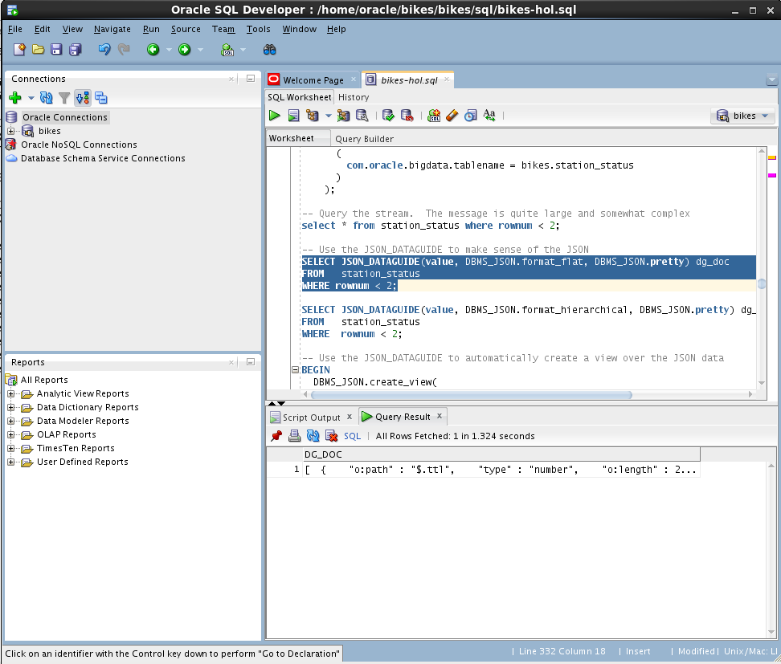
- 
    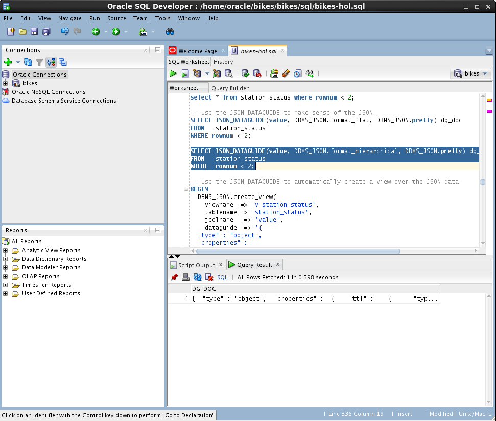
- Use a PL/SQL statement to create the `v_stations_status` view from the `station_status` table
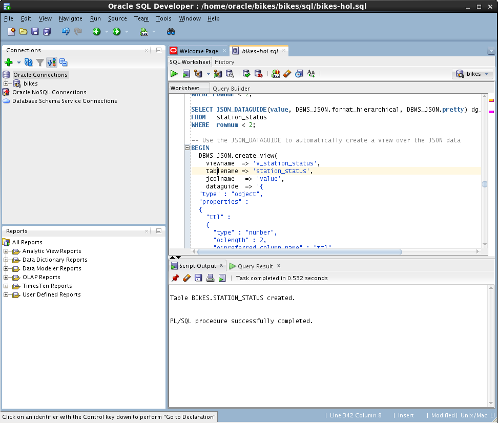
- Query this newly created view
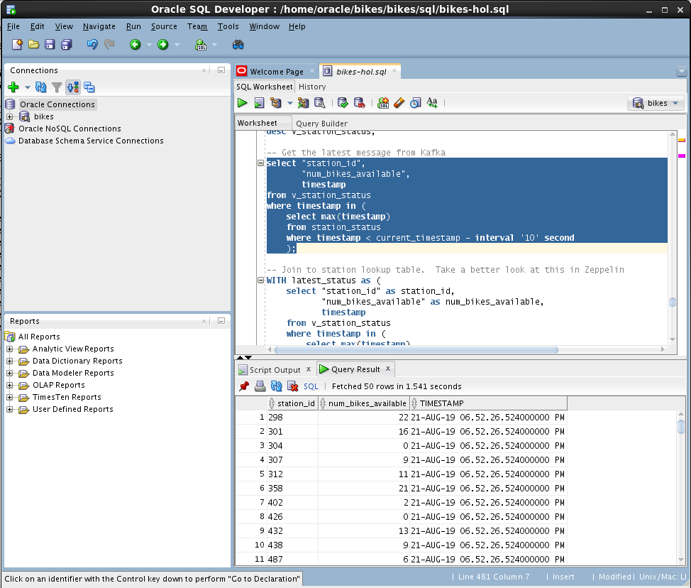
- Check how many bikes are available per station and join with station description table `station` 
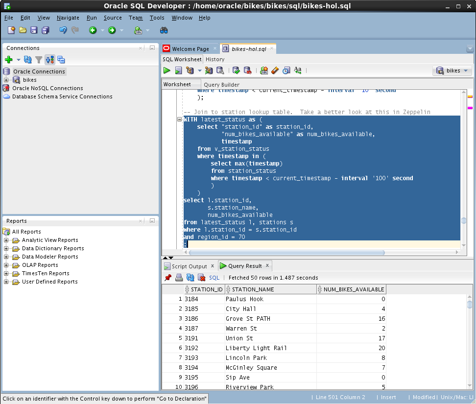

### **STEP 5:** Review the results in zeppelin
- Connect to zeppelin and review the results 
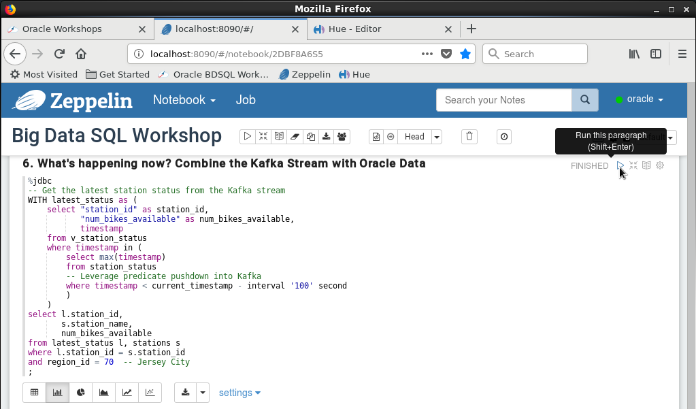
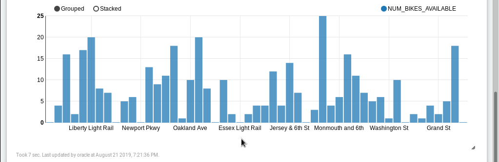

## Summary
You have accessed station status stored in Kafka streams, used the JSON_DATAGUIDE feature to parse the JSON format and displayed station bikes availability in zeppelin.
**This completes the Lab!**

**You are ready to proceed to [Lab 500](LabGuide100.md)**
