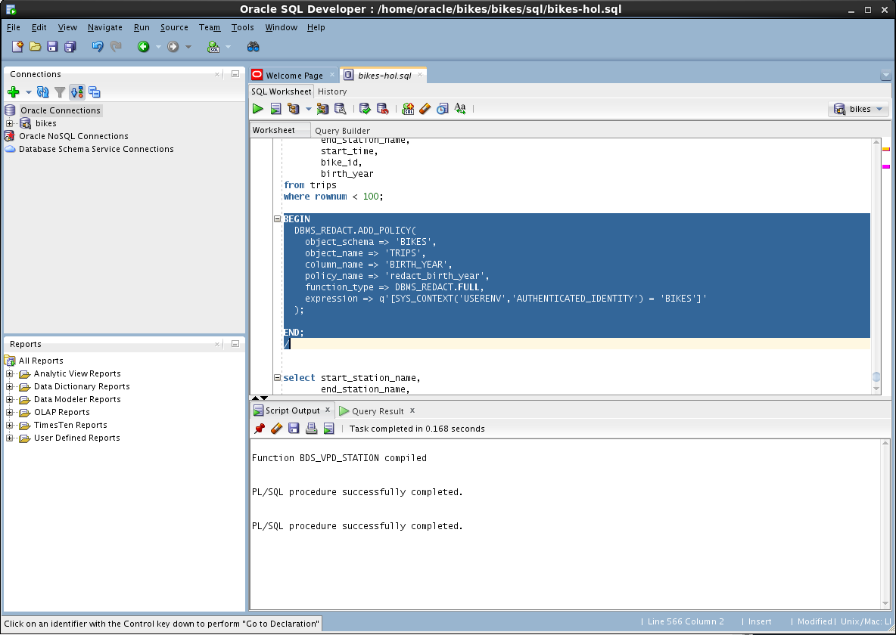

# Lab 500: Secure the data

  

## Introduction

## Lab 500 Objectives

## Steps

### **STEP 1:** Your Oracle Cloud Trial Account
- Create a function `BDS_VPD_STATION` to limit to station_id 3186 as starting or ending station

- Add a policy to the `bikes` table

- Query the `bikes` table and notice the change

- Query the `trips` table 
notice the `birth_year` column

- Run the data redaction statement on the `trips` table

- Query the `trips`table showing the `birth_year` column being redacted

**This completes the Lab!**
