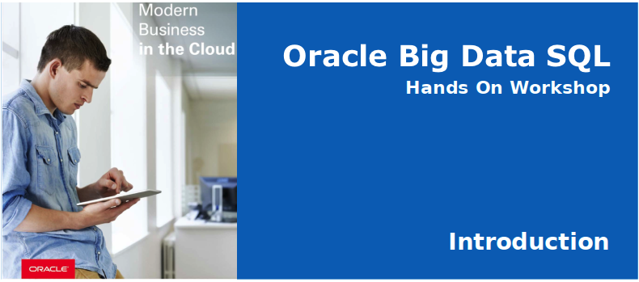

# Oracle Big Data SQL

Welcome to the Big Data SQL Workshop!  Big Data SQL is an enabling technology that allows your applications to use Oracle Database to easily gain insights across a variety of big data sources.  The goal for the workshop is to give you an understanding of how Big Data SQL works.  Specifically, the focus is on Big Data SQL functional capabilities:  how to access data from different sources (object store, hdfs, hive and Kafka), running queries across these sources and applying security.  

## Background 
The workshop is based on information from the NYC Citi Bikes Ridesharing program - [you can see the data here](https://data.cityofnewyork.us/NYC-BigApps/Citi-Bike-System-Data/vsnr-94wk).  A rider picks up a bike from a station anywhere in  the city - takes a trip - and then drops off his/her bike at another station.  The ending station may or may not be the same.  We combine this information with historical ridership, station details and weather data - and then ask questions like:

- What are the overall ridership trends?  (from ***Oracle Database***)
- How is this affected by weather?  (from ***Oracle Object Store***)
- Find trends in bicycle problems  (from ***Hive***)
- What is the current bicycle deployment (from ***Kafka***) 
- How do we ensure that the right bicycle inventory is deployed to various stations? (from all of these sources)
 
#### Tools you will be using 
We'll answer these questions using a variety of tools:  SQL Developer, Apache Zeppelin and Hue.  You may be new to Zeppelin.  Zeppelin is a notebook that lets you run a variety of technologies (SQL, python, R, spark, etc.) - all within a single "Note".  It makes it easy to jump between different technologies from within a single UI.  You will be running shell scripts, sql scripts, running interactive SQL commands, creating charts.  Zeppelin may not be the best for any one of the tasks (e.g. I would much rather be using SQL Developer for running/debugging SQL) - but it works well for this instructional workshop.

## Workshop Contents 
Here are the tasks that you will perform during the workshop.  Each lab builds on the previous, combining data from all of the different sources:

- __Lab 100:  Review Ridership__ -  Access Weather data from Oracle Object Store and combine with ridership data in Oracle Database
- __Lab 200:  Gather Station Details__ -  Add station data from HDFS and query the JSON source using Oracle JSON dot notation
- __Lab 300:  Understand Trips and Bike Usage__ -  Access all bike trips from Hive.  Use analytic SQL to understand bike movement and bike problems
- __Lab 400:  How are bikes deployed right now?__ - Query a Kafka stream for the latest information.  Combine the stream with dimensional data in Oracle Database.
- __Lab 500:  Secure the data__ - Apply advanced Oracle security policies across all the sources

## **Navigate to Lab 100**

  - _You can see a list of Lab Guides_ by clicking on the **Menu Icon** in the upper left corner of the browser window.

  

  

You're now ready to continue with [**Lab 100**](LabGuide100.md).